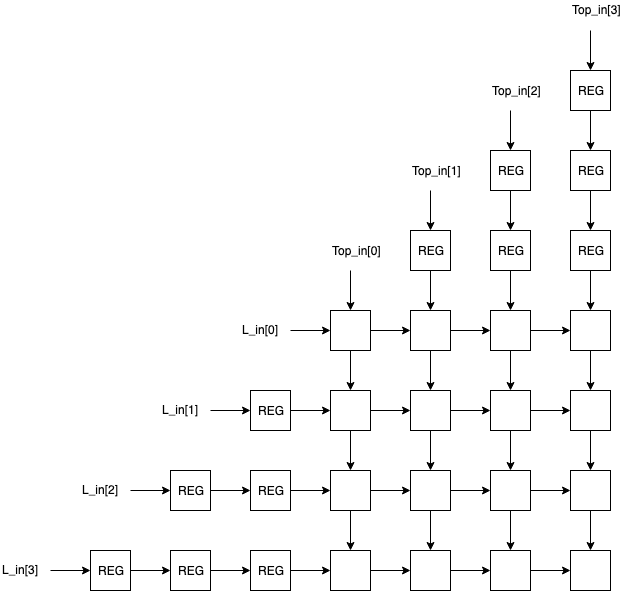

# Parameterizable  Systolic Array

Systolic array written in Python Migen that can be synthesized into verilog as shown below.
Systolic arrays can be used to multiply matrices by making an array of MACs(multiply accumulate units) in hardware.


```bash
make rtl
python3 gen_systolic_array_rtl.py
Verilog written to _rtl_out/systolic_array.v
```
Snippet from ```_rtl_out/systolic_array.v```.

```verilog
module top(
	input signed [7:0] L_in,
	input signed [7:0] L_in_1,
	input signed [7:0] L_in_2,
	input signed [7:0] L_in_3,
	input signed [7:0] Top_in,
	input signed [7:0] Top_in_1,
	input signed [7:0] Top_in_2,
	input signed [7:0] Top_in_3,
	output reg signed [7:0] SUM,
	output reg signed [7:0] SUM_1,
	output reg signed [7:0] SUM_2,
	output reg signed [7:0] SUM_3,
	output reg signed [7:0] SUM_4,
	output reg signed [7:0] SUM_5,
	output reg signed [7:0] SUM_6,
	output reg signed [7:0] SUM_7,
	output reg signed [7:0] SUM_8,
	output reg signed [7:0] SUM_9,
	output reg signed [7:0] SUM_10,
	output reg signed [7:0] SUM_11,
	output reg signed [7:0] SUM_12,
	output reg signed [7:0] SUM_13,
	output reg signed [7:0] SUM_14,
	output reg signed [7:0] SUM_15,
	input sys_clk,
	input sys_rst
);
```

## Dependencies
 - python3
 - [migen]
 - [numpy] - for the testbench

[migen]: https://github.com/m-labs/migen
[numpy]: https://numpy.org

## Testbench
Feeds to simple matrices into the systolic array.
The output is compared with the numpy.matmul() result.

```bash
make test
python3 testbench.py
SYSTOLIC ARRAY OUTPUT:
[[ 56.  62.  68.  74.]
 [152. 174. 196. 218.]
 [248. 286. 324. 362.]
 [344. 398. 452. 506.]]

NUMPY OUTPUT:
[[ 56  62  68  74]
 [152 174 196 218]
 [248 286 324 362]
 [344 398 452 506]]

EXECUTED FOR 11 CYCLES
Verilog written to _sim_out/systolic_array.vcd
```

## TODO
 - [ ] make unit tests that take dimensions and arbitrary matrices as parameters
